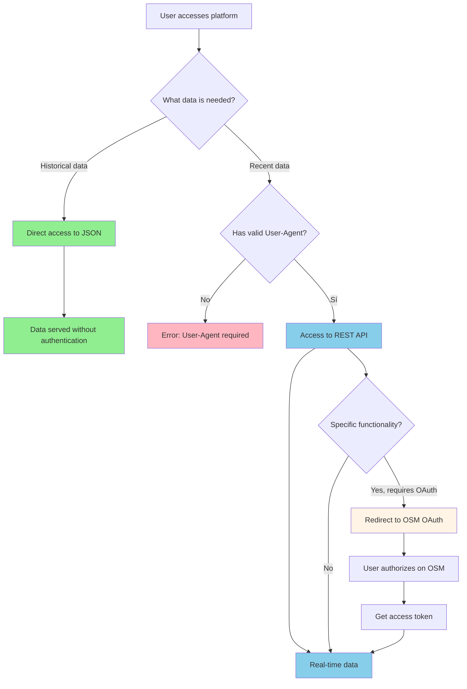
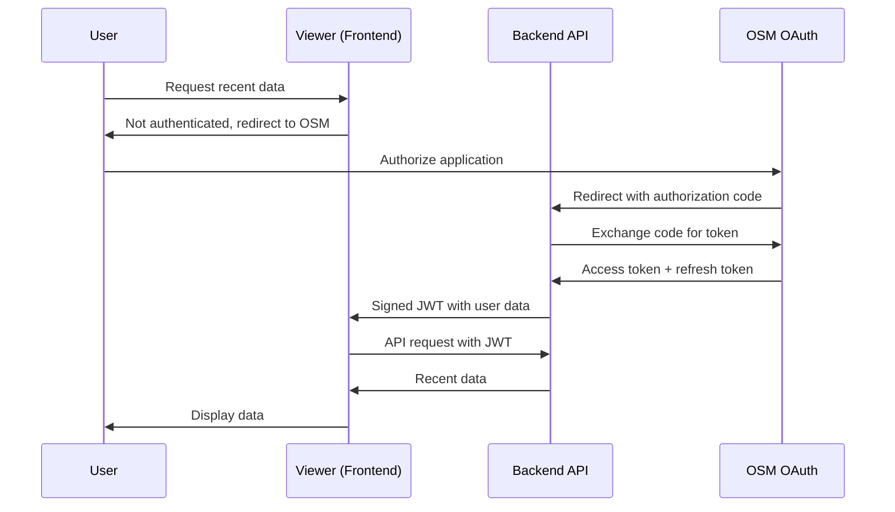

# Hybrid Authentication Strategy

**Purpose**: This document describes the hybrid authentication strategy for OSM Notes Viewer,
aligned with the model proposed in [OSM-Notes-API](https://github.com/OSM-Notes/OSM-Notes-API),
where historical data is publicly accessible while recent data requires a valid User-Agent (OAuth
optional for specific functionalities).

**Last Updated**: 2025-01-27

**Reference**: This strategy is aligned with
[API_Proposal.md](../OSM-Notes-API/docs/API_Proposal.md) from the OSM-Notes-API project.

---

## 📋 Executive Summary

The strategy divides data access into two levels:

1. **Historical Data (JSON)**: Public access with no restrictions
   - Static data exported daily
   - No authentication required
   - JSON files served statically

2. **Recent Data (REST API)**: Controlled access with User-Agent required
   - Real-time data (updated every 15 minutes)
   - **User-Agent required** (mandatory) - format: `AppName/Version (Contact)`
   - Rate limiting by IP + User-Agent
   - OAuth with OSM **optional** only for functionalities that require specific user identity

---

## 🎯 Objectives

### Security and Control

- ✅ **Abuse reduction**: Rate limiting by IP + User-Agent to prevent malicious use
- ✅ **Rate limiting**: Usage control by application (identified by User-Agent)
- ✅ **Traceability**: User-Agent allows application tracking without friction
- ✅ **Selective blocking**: Ability to block problematic IPs or User-Agents

### Analysis and Improvement

- ✅ **Usage analysis**: Statistics on which applications use the platform (User-Agent)
- ✅ **Geographic analysis**: Countries from where access occurs (IP geolocation)
- ✅ **Feature analysis**: Which endpoints and options are most popular
- ✅ **Continuous improvement**: Data to make informed decisions about improvements

### User Experience

- ✅ **Easy access**: User-Agent is simple to implement, with no barriers to entry
- ✅ **Lower friction**: Does not require OAuth authentication for basic use
- ✅ **Natural progression**: User-Agent sufficient for most cases; OAuth only if specific
  functionality is needed

---

## 🏗️ Architecture

### Data Model

```
┌─────────────────────────────────────────────────────────────┐
│                    OSM Notes Viewer                         │
└─────────────────────────────────────────────────────────────┘
                              │
        ┌─────────────────────┼─────────────────────┐
        │                     │                     │
        ▼                     ▼                     ▼
┌───────────────┐    ┌──────────────────┐   ┌──────────────┐
│ Historical    │    │ REST API         │   │ Authentication│
│ Data          │    │ (Recent Data)    │   │ (Optional)   │
│ (JSON)        │    │                  │   │              │
├───────────────┤    ├──────────────────┤   ├──────────────┤
│ ✅ Public     │    │ ⚠️ User-Agent    │   │ • OAuth 2.0  │
│ ✅ No Auth    │    │    Required      │   │   (Optional) │
│ ✅ Static     │    │ ⚡ Rate Limited  │   │ • Only for   │
│ ✅ Daily      │    │ ✅ Real-Time     │   │   specific   │
│               │    │ ✅ 15 min update │   │   functions  │
└───────────────┘    └──────────────────┘   └──────────────┘
```

### Access Flow



---

## 📊 Data Division

### Historical Data (Public Access - JSON)

These endpoints **DO NOT require authentication**:

#### 1. Metadata

- `GET /data/metadata.json`
- Information about data export
- Update frequency: Daily

#### 2. Indexes

- `GET /data/indexes/users.json` - List of users
- `GET /data/indexes/countries.json` - List of countries
- Basic data for search and navigation
- Update frequency: Daily

#### 3. Historical Profiles

- `GET /data/users/{user_id}.json` - Complete user profile
- `GET /data/countries/{country_id}.json` - Complete country profile
- Historical statistics (lifetime, year, month)
- Historical rankings
- Historical activity heatmaps
- Update frequency: Daily (snapshot)

**Characteristics**:

- ✅ No authentication
- ✅ No rate limiting (except basic IP)
- ✅ Aggressively cacheable
- ✅ Served as static files

### Recent Data (User-Agent Required - REST API)

These endpoints **REQUIRE valid User-Agent** (format: `AppName/Version (Contact)`):

#### 1. Recent User Activity

- `GET /api/v1/users/{user_id}/recent-activity` ⚠️
  - `notes_created_last_30_days`
  - `notes_resolved_last_30_days`
  - `days_since_last_action`
  - `active_notes_count`
  - `countries_open_notes_current_month`
  - `countries_solving_notes_current_day`

#### 2. Current Country Statistics

- `GET /api/v1/countries/{country_id}/current-stats` ⚠️
  - `currently_open_count`
  - `currently_closed_count`
  - `notes_created_last_30_days`
  - `notes_resolved_last_30_days`
  - `notes_backlog_size`
  - `notes_health_score`
  - `new_vs_resolved_ratio`

#### 3. Global Statistics

- `GET /api/v1/global/current-stats` ⚠️
  - `currently_open_count`
  - `currently_closed_count`
  - `notes_created_last_30_days`
  - `notes_resolved_last_30_days`
  - `active_users_count`
  - `notes_age_distribution`

#### 4. Dynamic Queries

- `GET /api/v1/users?country={id}&min_notes={count}&sort={field}` ⚠️
- `GET /api/v1/countries?health_score_min={score}&sort={field}` ⚠️
- `GET /api/v1/users?hashtag={tag}&date_from={date}&date_to={date}` ⚠️
- `GET /api/v1/users/rankings?metric={field}&limit={count}` ⚠️
- `GET /api/v1/countries/rankings?metric={field}&limit={count}` ⚠️
- `GET /api/v1/compare/users?ids={id1,id2,id3}` ⚠️
- `GET /api/v1/compare/countries?ids={id1,id2,id3}` ⚠️

**Characteristics**:

- ⚠️ **User-Agent required** (mandatory for all endpoints)
- ⚡ Rate limiting by IP + User-Agent (100 requests/15min by default)
- 🔄 Update every 15 minutes
- 📊 Usage logging for analysis (tracking by User-Agent)

### Endpoints that Require OAuth (Optional/Future)

These endpoints **DO require OAuth** only if specific functionalities that need OSM user identity
are implemented:

- `GET /api/v1/users/me/*` 🔒 - Authenticated user's personal profile
- `GET /api/v1/users/me/activity` 🔒 - User's personal activity
- Premium features specific to users
- Write endpoints (if added in the future)

**Note**: Most endpoints do not require OAuth. User-Agent is sufficient for tracking and access
control.

---

## 🔐 Authentication Implementation

### User-Agent Required (Primary)

**Requirement**: All requests to the REST API MUST include a valid User-Agent with the application
name.

**Required Format**:

```
User-Agent: <AppName>/<Version> (<Contact>)
```

**Valid Examples**:

```
User-Agent: OSMNotesViewer/1.0 (https://github.com/OSM-Notes/OSM-Notes-Viewer)
User-Agent: MyOSMApp/2.1 (contact@example.com)
User-Agent: ResearchTool/0.5 (researcher@university.edu)
```

**Backend Validation**:

- If User-Agent is not present or invalid, return 400 error
- Extract information (AppName, Version, Contact) for logging
- Use for rate limiting and usage analysis

### OAuth Implementation (Optional/Future)

OAuth is only required if specific functionalities that need OSM user identity are implemented.

#### Application Registration in OSM

1. **Create OAuth application in OSM**:
   - Go to https://www.openstreetmap.org/user/{username}/oauth_clients/new
   - Name: "OSM Notes Viewer"
   - Redirect URL: `https://your-domain.com/auth/callback`
   - Permissions: Read-only (`read_prefs`)

2. **Obtain credentials**:
   - `CLIENT_ID`: Public application ID
   - `CLIENT_SECRET`: Private secret (store securely)
   - `REDIRECT_URI`: Configured callback URL

#### OAuth 2.0 Flow (Authorization Code Flow) - Only for Specific Endpoints



### Implementation Steps

#### 1. Frontend: Configure User-Agent

```javascript
// src/js/api/apiClient.js
const APP_CONFIG = {
  name: 'OSMNotesViewer',
  version: '1.0.0',
  contact: 'https://github.com/OSM-Notes/OSM-Notes-Viewer',
};

// Helper function to get valid User-Agent
export function getUserAgent() {
  return `${APP_CONFIG.name}/${APP_CONFIG.version} (${APP_CONFIG.contact})`;
}

// Make requests with User-Agent
export async function makeAPIRequest(endpoint) {
  const response = await fetch(endpoint, {
    headers: {
      'User-Agent': getUserAgent(),
      'Content-Type': 'application/json',
    },
  });

  if (response.status === 400 && response.body.error?.includes('User-Agent')) {
    throw new Error('User-Agent header is required');
  }

  return response.json();
}
```

#### 2. Backend: Validate User-Agent

```javascript
// Backend: Middleware to validate User-Agent
function validateUserAgent(req, res, next) {
  const userAgent = req.get('User-Agent');

  if (!userAgent) {
    return res.status(400).json({
      error: 'User-Agent header is required',
      message:
        'Please include a User-Agent header with your application name and contact information. Format: AppName/Version (Contact)',
    });
  }

  // Validate basic format
  const userAgentPattern = /^[\w\-\.]+\/[\w\-\.]+/;
  if (!userAgentPattern.test(userAgent)) {
    return res.status(400).json({
      error: 'Invalid User-Agent format',
      message: 'User-Agent must follow format: AppName/Version (Contact)',
    });
  }

  // Extract information for logging
  const match = userAgent.match(/^([^\/]+)\/([^\s]+)(?:\s+\(([^)]+)\))?/);
  req.userAgentInfo = {
    appName: match[1],
    version: match[2],
    contact: match[3] || null,
  };

  next();
}

// Apply to all API routes
app.use('/api/v1', validateUserAgent);
```

#### 3. Frontend: Initiate OAuth (Optional - Only if Required)

```javascript
// src/js/auth/osmAuth.js (Solo necesario para endpoints específicos)
const OSM_OAUTH_CONFIG = {
  clientId: 'YOUR_CLIENT_ID',
  redirectUri: `${window.location.origin}/auth/callback`,
  authorizationUrl: 'https://www.openstreetmap.org/oauth2/authorize',
  scope: 'read_prefs',
  responseType: 'code',
};

export function initiateOSMLogin() {
  const state = generateRandomState();
  sessionStorage.setItem('oauth_state', state);

  const params = new URLSearchParams({
    client_id: OSM_OAUTH_CONFIG.clientId,
    redirect_uri: OSM_OAUTH_CONFIG.redirectUri,
    response_type: 'code',
    scope: OSM_OAUTH_CONFIG.scope,
    state: state,
  });

  window.location.href = `${OSM_OAUTH_CONFIG.authorizationUrl}?${params}`;
}
```

#### 4. Backend: Callback Handler (OAuth - Optional)

```javascript
// Backend: /auth/callback
app.get('/auth/callback', async (req, res) => {
  const { code, state } = req.query;

  // Validate state (CSRF protection)
  if (state !== req.session.oauth_state) {
    return res.status(400).send('Invalid state');
  }

  // Exchange code for token
  const tokenResponse = await fetch('https://www.openstreetmap.org/oauth2/token', {
    method: 'POST',
    headers: { 'Content-Type': 'application/x-www-form-urlencoded' },
    body: new URLSearchParams({
      grant_type: 'authorization_code',
      code: code,
      redirect_uri: OSM_OAUTH_CONFIG.redirectUri,
      client_id: CLIENT_ID,
      client_secret: CLIENT_SECRET,
    }),
  });

  const tokens = await tokenResponse.json();

  // Get user information
  const userInfo = await fetch('https://api.openstreetmap.org/api/0.6/user/details', {
    headers: { Authorization: `Bearer ${tokens.access_token}` },
  });

  // Create JWT for session
  const sessionToken = createJWT({
    osmUserId: userInfo.id,
    osmUsername: userInfo.display_name,
    expiresIn: '7d',
  });

  // Save tokens in database for refresh
  await saveUserSession(userInfo.id, tokens);

  // Redirect to frontend with token
  res.redirect(`${FRONTEND_URL}/auth/success?token=${sessionToken}`);
});
```

#### 5. Frontend: Save Token and Use

```javascript
// src/js/auth/osmAuth.js
export function handleAuthCallback() {
  const urlParams = new URLSearchParams(window.location.search);
  const token = urlParams.get('token');

  if (token) {
    localStorage.setItem('osm_auth_token', token);
    // Decode JWT to get user info
    const userInfo = decodeJWT(token);
    updateUIWithUserInfo(userInfo);
  }
}

export async function getAuthenticatedUser() {
  const token = localStorage.getItem('osm_auth_token');
  if (!token) return null;

  try {
    const decoded = decodeJWT(token);
    if (decoded.exp < Date.now() / 1000) {
      // Token expired, try refresh
      return await refreshToken();
    }
    return decoded;
  } catch (error) {
    return null;
  }
}

export async function makeAuthenticatedRequest(endpoint) {
  const token = localStorage.getItem('osm_auth_token');

  const response = await fetch(endpoint, {
    headers: {
      Authorization: `Bearer ${token}`,
      'Content-Type': 'application/json',
    },
  });

  if (response.status === 401) {
    // Invalid token, redirect to login
    initiateOSMLogin();
    throw new Error('Authentication required');
  }

  return response.json();
}
```

#### 6. Backend: OAuth Authentication Middleware (Optional)

```javascript
// Backend: Middleware for endpoints that require OAuth
function requireOAuth(req, res, next) {
  const token = req.headers.authorization?.replace('Bearer ', '');

  if (!token) {
    return res.status(401).json({ error: 'OAuth authentication required' });
  }

  try {
    const decoded = verifyJWT(token);
    req.user = decoded; // Attach user info to request
    next();
  } catch (error) {
    return res.status(401).json({ error: 'Invalid token' });
  }
}

// Example: Endpoint that requires OAuth (only for specific functionalities)
app.get('/api/v1/users/me/activity', requireOAuth, async (req, res) => {
  // Log access for analysis
  await logAPIAccess({
    userId: req.user.osmUserId,
    username: req.user.osmUsername,
    endpoint: req.path,
    ip: req.ip,
    userAgent: req.userAgentInfo,
    timestamp: new Date(),
  });

  // Get authenticated user's personal activity
  const data = await getUserPersonalActivity(req.user.osmUserId);
  res.json(data);
});

// Example: Normal endpoint (only requires User-Agent)
app.get('/api/v1/users/:id/recent-activity', async (req, res) => {
  // Log access for analysis (using User-Agent)
  await logAPIAccess({
    userAgent: req.userAgentInfo,
    endpoint: req.path,
    ip: req.ip,
    timestamp: new Date(),
  });

  // Get recent data
  const data = await getRecentActivity(req.params.id);
  res.json(data);
});
```

---

## 📈 Analysis and Logging System

### Data to Record

For each request, record (User-Agent always available, OAuth info only if applicable):

```javascript
{
    // Identification by User-Agent (always available)
    user_agent: string,
    app_name: string,
    app_version: string,
    app_contact: string,

    // OAuth identification (only if authenticated)
    osm_user_id: number | null,
    osm_username: string | null,

    // Request
    endpoint: string,
    method: string,
    query_params: object,
    timestamp: ISO8601,

    // Location
    ip_address: string,
    country_code: string,  // Derived from IP

    // Performance
    response_time_ms: number,
    status_code: number,

    // Metadata
    request_id: string
}
```

### Possible Analyses

#### 1. Usage Analysis by Application (User-Agent)

```sql
-- Most active applications
SELECT app_name, app_version, COUNT(*) as requests,
       COUNT(DISTINCT endpoint) as unique_endpoints,
       COUNT(DISTINCT ip_address) as unique_ips
FROM api_access_logs
WHERE timestamp > NOW() - INTERVAL '30 days'
GROUP BY app_name, app_version
ORDER BY requests DESC
LIMIT 100;
```

#### 1b. Usage Analysis by OSM User (Only if OAuth Implemented)

```sql
-- Most active OSM users (only for authenticated requests)
SELECT osm_username, COUNT(*) as requests,
       COUNT(DISTINCT endpoint) as unique_endpoints
FROM api_access_logs
WHERE timestamp > NOW() - INTERVAL '30 days'
  AND osm_user_id IS NOT NULL
GROUP BY osm_user_id, osm_username
ORDER BY requests DESC
LIMIT 100;
```

#### 2. Geographic Analysis

```sql
-- Distribution by country
SELECT country_code, COUNT(*) as requests,
       COUNT(DISTINCT osm_user_id) as unique_users
FROM api_access_logs
WHERE timestamp > NOW() - INTERVAL '30 days'
GROUP BY country_code
ORDER BY requests DESC;
```

#### 3. Endpoint Analysis

```sql
-- Most popular endpoints
SELECT endpoint, COUNT(*) as requests,
       AVG(response_time_ms) as avg_response_time,
       COUNT(DISTINCT osm_user_id) as unique_users
FROM api_access_logs
WHERE timestamp > NOW() - INTERVAL '30 days'
GROUP BY endpoint
ORDER BY requests DESC;
```

#### 4. Temporal Usage Patterns

```sql
-- Usage by hour of day
SELECT EXTRACT(HOUR FROM timestamp) as hour,
       COUNT(*) as requests
FROM api_access_logs
WHERE timestamp > NOW() - INTERVAL '7 days'
GROUP BY hour
ORDER BY hour;
```

#### 5. Retention Analysis

```sql
-- Returning vs new users
SELECT
    CASE
        WHEN first_access < NOW() - INTERVAL '30 days' THEN 'Returning'
        ELSE 'New'
    END as user_type,
    COUNT(DISTINCT osm_user_id) as user_count
FROM (
    SELECT osm_user_id, MIN(timestamp) as first_access
    FROM api_access_logs
    GROUP BY osm_user_id
) first_accesses
GROUP BY user_type;
```

### Metrics Dashboard

Create an internal dashboard that shows:

- 📊 **Active users**: Last 24h, 7 days, 30 days
- 🌍 **Country map**: Geographic distribution of access
- 📈 **Popular endpoints**: Which data is most queried
- ⏱️ **Temporal patterns**: Hours and days of highest usage
- 🔍 **Common searches**: Which filters and parameters are used most
- ⚠️ **Alerts**: Users with suspicious behavior

---

## 🚦 Rate Limiting

### Limits by IP + User-Agent

```javascript
// Rate limiting configuration (aligned with API_Proposal.md)
const RATE_LIMITS = {
  general: {
    windowMs: 15 * 60 * 1000, // 15 minutes
    maxRequests: 100,
    burstLimit: 20,
  },
  search: {
    windowMs: 15 * 60 * 1000,
    maxRequests: 50,
    burstLimit: 10,
  },
  analytics: {
    windowMs: 60 * 60 * 1000, // 1 hour
    maxRequests: 200,
    burstLimit: 30,
  },
};

// Implementation with Redis (rate limiting by IP + User-Agent)
async function checkRateLimit(req, endpointType = 'general') {
  const ip = req.ip;
  const userAgent = req.get('User-Agent') || 'unknown';
  const key = `ratelimit:${ip}:${userAgent}:${endpointType}`;

  const limits = RATE_LIMITS[endpointType];
  const current = await redis.incr(key);

  if (current === 1) {
    await redis.expire(key, limits.windowMs / 1000);
  }

  if (current > limits.maxRequests) {
    throw new RateLimitError(
      `Rate limit exceeded: ${limits.maxRequests} requests per ${limits.windowMs / 1000 / 60} minutes`
    );
  }

  return {
    remaining: Math.max(0, limits.maxRequests - current),
    reset: await redis.ttl(key),
    limit: limits.maxRequests,
  };
}
```

### Rate Limiting Headers

Include rate limit information in responses:

```http
HTTP/1.1 200 OK
X-RateLimit-Limit: 1000
X-RateLimit-Remaining: 987
X-RateLimit-Reset: 1642680000
```

---

## 🛡️ Client-Side Protection (Viewer)

### Objective

The viewer must implement protections to:

1. **Not overload the server**: Avoid excessive requests from the client
2. **Respect rate limits**: Properly handle when the server limits requests
3. **Prevent massive scraping**: Detect and limit anomalous patterns
4. **Optimize resource usage**: Aggressive caching and intelligent requests

### Protection Strategies

#### 1. Client Rate Limiting

The viewer must implement client-side rate limiting to not exceed server limits:

```javascript
// src/js/utils/rateLimiter.js
class ClientRateLimiter {
  constructor() {
    this.requestQueue = [];
    this.requestCounts = new Map(); // endpoint -> { count, resetTime }
    this.maxConcurrentRequests = 5; // Maximum concurrent requests
    this.activeRequests = 0;

    // Limits by endpoint type (aligned with server)
    this.limits = {
      general: { max: 80, windowMs: 15 * 60 * 1000 }, // 80% of server limit (100)
      search: { max: 40, windowMs: 15 * 60 * 1000 }, // 80% of server limit (50)
      analytics: { max: 160, windowMs: 60 * 60 * 1000 }, // 80% of server limit (200)
    };
  }

  async request(endpoint, options = {}) {
    const endpointType = this.getEndpointType(endpoint);
    const limit = this.limits[endpointType];

    // Check local limit
    if (!this.canMakeRequest(endpoint, endpointType, limit)) {
      const resetTime = this.getResetTime(endpoint, endpointType);
      const waitTime = resetTime - Date.now();

      console.warn(`Local rate limit reached for ${endpoint}. Waiting ${waitTime}ms`);
      await this.wait(waitTime);
    }

    // Limit concurrent requests
    while (this.activeRequests >= this.maxConcurrentRequests) {
      await this.wait(100); // Wait 100ms before retrying
    }

    this.activeRequests++;
    this.incrementCount(endpoint, endpointType);

    try {
      const response = await fetch(endpoint, options);

      // Check server rate limit headers
      const remaining = parseInt(response.headers.get('X-RateLimit-Remaining') || '0', 10);
      const limit = parseInt(response.headers.get('X-RateLimit-Limit') || '100', 10);

      if (remaining < 10) {
        console.warn(`Server rate limit almost reached: ${remaining}/${limit} requests remaining`);
      }

      // If server responds with 429 (Too Many Requests)
      if (response.status === 429) {
        const retryAfter = parseInt(response.headers.get('Retry-After') || '60', 10);
        console.error(`Server rate limit exceeded. Retrying in ${retryAfter} seconds`);

        // Update local limits to be more conservative
        this.adjustLocalLimits(endpointType, 0.5); // Reduce to 50%

        throw new RateLimitError(`Rate limit exceeded. Retry in ${retryAfter} seconds`, retryAfter);
      }

      return response;
    } finally {
      this.activeRequests--;
    }
  }

  canMakeRequest(endpoint, endpointType, limit) {
    const key = `${endpointType}:${endpoint}`;
    const record = this.requestCounts.get(key);

    if (!record) return true;

    // If window time expired, reset
    if (Date.now() > record.resetTime) {
      this.requestCounts.delete(key);
      return true;
    }

    return record.count < limit.max;
  }

  incrementCount(endpoint, endpointType) {
    const key = `${endpointType}:${endpoint}`;
    const limit = this.limits[endpointType];
    const record = this.requestCounts.get(key) || {
      count: 0,
      resetTime: Date.now() + limit.windowMs,
    };

    record.count++;
    this.requestCounts.set(key, record);
  }

  getEndpointType(endpoint) {
    if (endpoint.includes('/search') || endpoint.includes('/rankings')) {
      return 'search';
    }
    if (endpoint.includes('/analytics') || endpoint.includes('/global')) {
      return 'analytics';
    }
    return 'general';
  }

  wait(ms) {
    return new Promise((resolve) => setTimeout(resolve, ms));
  }
}

export const clientRateLimiter = new ClientRateLimiter();
```

#### 2. Aggressive Caching

The viewer must use aggressive caching to minimize requests to the server:

```javascript
// src/js/utils/cache.js (improved)
class AggressiveCache {
  constructor() {
    this.cache = new Map();
    this.timestamps = new Map();
    this.maxCacheSize = 1000; // Maximum cache entries
  }

  // Longer TTL for historical data
  getTTL(endpoint) {
    if (endpoint.includes('/metadata.json')) return 5 * 60 * 1000; // 5 min
    if (endpoint.includes('/indexes/')) return 15 * 60 * 1000; // 15 min
    if (endpoint.includes('/users/') || endpoint.includes('/countries/')) {
      return 15 * 60 * 1000; // 15 min for profiles
    }
    // For recent API data, shorter TTL
    if (endpoint.includes('/recent-activity') || endpoint.includes('/current-stats')) {
      return 5 * 60 * 1000; // 5 min
    }
    return 15 * 60 * 1000; // Default: 15 min
  }

  get(key) {
    const timestamp = this.timestamps.get(key);
    if (!timestamp) return null;

    const age = Date.now() - timestamp;
    const ttl = this.getTTL(key);

    if (age > ttl) {
      this.delete(key);
      return null;
    }

    return this.cache.get(key);
  }

  set(key, value) {
    // If cache is full, remove oldest entries
    if (this.cache.size >= this.maxCacheSize) {
      this.evictOldest();
    }

    this.cache.set(key, value);
    this.timestamps.set(key, Date.now());
  }

  evictOldest() {
    let oldestKey = null;
    let oldestTime = Infinity;

    for (const [key, time] of this.timestamps.entries()) {
      if (time < oldestTime) {
        oldestTime = time;
        oldestKey = key;
      }
    }

    if (oldestKey) {
      this.delete(oldestKey);
    }
  }

  delete(key) {
    this.cache.delete(key);
    this.timestamps.delete(key);
  }
}

export const aggressiveCache = new AggressiveCache();
```

#### 3. Request Debouncing and Throttling

For searches and filters, implement debouncing:

```javascript
// src/js/utils/debounce.js
export function debounce(func, wait) {
  let timeout;
  return function executedFunction(...args) {
    const later = () => {
      clearTimeout(timeout);
      func(...args);
    };
    clearTimeout(timeout);
    timeout = setTimeout(later, wait);
  };
}

// Example usage in search
const debouncedSearch = debounce(async (query) => {
  if (query.length < 2) return; // Don't search with less than 2 characters
  await performSearch(query);
}, 300); // Wait 300ms after last change
```

#### 4. Anomalous Pattern Detection

Detect and prevent suspicious behavior:

```javascript
// src/js/utils/abuseDetector.js
class AbuseDetector {
  constructor() {
    this.requestHistory = [];
    this.suspiciousPatterns = [];
    this.maxRequestsPerSecond = 10; // Maximum 10 requests per second
    this.maxRequestsPerMinute = 100; // Maximum 100 requests per minute
  }

  recordRequest(endpoint) {
    const now = Date.now();
    this.requestHistory.push({ endpoint, timestamp: now });

    // Keep only last 60 seconds
    this.requestHistory = this.requestHistory.filter((req) => now - req.timestamp < 60000);

    // Detect suspicious patterns
    if (this.isSuspiciousPattern()) {
      console.warn('Suspicious request pattern detected. Limiting requests.');
      this.triggerRateLimit();
      return false;
    }

    return true;
  }

  isSuspiciousPattern() {
    const now = Date.now();
    const lastSecond = this.requestHistory.filter((req) => now - req.timestamp < 1000).length;

    const lastMinute = this.requestHistory.length;

    // If exceeds limits, it's suspicious
    if (lastSecond > this.maxRequestsPerSecond) {
      return true;
    }

    if (lastMinute > this.maxRequestsPerMinute) {
      return true;
    }

    // Detect if making repeated requests very quickly
    const uniqueEndpoints = new Set(this.requestHistory.slice(-20).map((r) => r.endpoint));
    if (uniqueEndpoints.size < 3 && lastMinute > 50) {
      return true; // Many requests to few endpoints = possible scraping
    }

    return false;
  }

  triggerRateLimit() {
    // Add progressive delay
    this.suspiciousPatterns.push({
      timestamp: Date.now(),
      delay: Math.min(5000, this.suspiciousPatterns.length * 1000), // Up to 5 seconds
    });
  }

  getDelay() {
    const recentSuspicious = this.suspiciousPatterns.filter(
      (p) => Date.now() - p.timestamp < 60000
    );

    if (recentSuspicious.length === 0) return 0;

    // Return the highest delay from recent patterns
    return Math.max(...recentSuspicious.map((p) => p.delay));
  }
}

export const abuseDetector = new AbuseDetector();
```

#### 5. Enhanced API Client with All Protections

```javascript
// src/js/api/apiClient.js (improved version)
import { aggressiveCache } from '../utils/cache.js';
import { clientRateLimiter } from '../utils/rateLimiter.js';
import { abuseDetector } from '../utils/abuseDetector.js';

class ProtectedAPIClient {
  constructor() {
    this.baseURL = API_CONFIG.BASE_URL;
    this.userAgent = `${APP_CONFIG.name}/${APP_CONFIG.version} (${APP_CONFIG.contact})`;
  }

  async fetch(endpoint, options = {}) {
    // 1. Check cache first (more aggressive)
    const cached = aggressiveCache.get(endpoint);
    if (cached) {
      console.log(`Cache hit: ${endpoint}`);
      return cached;
    }

    // 2. Abuse detection
    if (!abuseDetector.recordRequest(endpoint)) {
      const delay = abuseDetector.getDelay();
      await this.wait(delay);
      throw new Error('Local request rate limit exceeded. Please wait a moment.');
    }

    // 3. Use client rate limiter
    const url = `${this.baseURL}${endpoint}`;
    const headers = {
      'User-Agent': this.userAgent,
      'Content-Type': 'application/json',
      ...options.headers,
    };

    try {
      const response = await clientRateLimiter.request(url, {
        ...options,
        headers,
      });

      // 4. Handle server rate limit errors
      if (response.status === 429) {
        const retryAfter = parseInt(response.headers.get('Retry-After') || '60', 10);
        console.error(`Server reports rate limit. Retrying in ${retryAfter}s`);

        // Show message to user
        this.showRateLimitWarning(retryAfter);

        throw new RateLimitError(`Server rate limit. Retry in ${retryAfter} seconds`);
      }

      if (!response.ok) {
        throw new Error(`HTTP ${response.status}: ${response.statusText}`);
      }

      const data = await response.json();

      // 5. Cache response
      aggressiveCache.set(endpoint, data);

      // 6. Update limits based on server headers
      this.updateLocalLimits(response);

      return data;
    } catch (error) {
      if (error instanceof RateLimitError) {
        // If rate limit, don't cache but re-throw
        throw error;
      }

      // For other errors, try to use stale cache if exists
      const staleCache = aggressiveCache.get(endpoint);
      if (staleCache) {
        console.warn(`Using stale cache due to error: ${error.message}`);
        return staleCache;
      }

      throw error;
    }
  }

  updateLocalLimits(response) {
    const remaining = parseInt(response.headers.get('X-RateLimit-Remaining') || '100', 10);
    const limit = parseInt(response.headers.get('X-RateLimit-Limit') || '100', 10);
    const percentage = remaining / limit;

    // If less than 20% of requests remaining, be more conservative
    if (percentage < 0.2) {
      clientRateLimiter.adjustLocalLimits('general', 0.5); // Reduce to 50%
    }
  }

  showRateLimitWarning(retryAfter) {
    // Show notification to user
    const message = `Request limit reached. Wait ${retryAfter} seconds before continuing.`;
    // Implement notification UI
    console.warn(message);
  }

  wait(ms) {
    return new Promise((resolve) => setTimeout(resolve, ms));
  }
}

export const protectedAPIClient = new ProtectedAPIClient();
```

#### 6. Limits and Recommended Configuration (Client Protection)

```javascript
// src/js/config/client-protection-config.js
export const CLIENT_PROTECTION_CONFIG = {
  // Client limits (more conservative than server)
  rateLimits: {
    general: {
      max: 80, // 80% of server limit (100)
      windowMs: 15 * 60 * 1000, // 15 minutes
      maxConcurrent: 5, // Maximum 5 concurrent requests
    },
    search: {
      max: 40, // 80% of server limit (50)
      windowMs: 15 * 60 * 1000,
      maxConcurrent: 3,
    },
    analytics: {
      max: 160, // 80% of server limit (200)
      windowMs: 60 * 60 * 1000,
      maxConcurrent: 3,
    },
  },

  // Cache settings
  cache: {
    maxSize: 1000, // Maximum entries
    defaultTTL: 15 * 60 * 1000, // 15 minutes
    metadataTTL: 5 * 60 * 1000, // 5 minutes
    indexesTTL: 15 * 60 * 1000, // 15 minutes
    profilesTTL: 15 * 60 * 1000, // 15 minutes
    recentDataTTL: 5 * 60 * 1000, // 5 minutes for recent data
  },

  // Abuse detection
  abuseDetection: {
    maxRequestsPerSecond: 10,
    maxRequestsPerMinute: 100,
    suspiciousThreshold: 0.8, // 80% of requests to few endpoints = suspicious
  },

  // Retry settings
  retry: {
    maxRetries: 3,
    retryDelay: 1000, // 1 second
    exponentialBackoff: true,
  },
};
```

### Implementation Checklist

- [ ] Implement client rate limiter
- [ ] Aggressive cache with appropriate TTLs
- [ ] Request debouncing for searches
- [ ] Limit concurrent requests
- [ ] Anomalous pattern detection
- [ ] Handle 429 errors (server rate limit)
- [ ] Respect server `X-RateLimit-*` headers
- [ ] UI to show rate limit warnings
- [ ] Fallback to cache when server is limited
- [ ] Request logging for debugging

### Benefits

1. **Protects the server**: Client won't make more requests than the server can handle
2. **Better experience**: User sees warnings before being blocked
3. **Resilient**: Uses cache when server is limited
4. **Detects abuse**: Identifies suspicious patterns before they reach the server
5. **Optimized**: Minimizes unnecessary requests with intelligent caching

---

## 🔄 Migration and Implementation Strategy

### Phase 1: Preparation (Current)

- ✅ Document strategy (this document)
- ✅ Design API endpoints
- ✅ Align with OSM-Notes-API model
- ⏳ Implement basic backend with User-Agent validation

### Phase 2: Gradual Implementation

1. **Basic API backend**
   - User-Agent validation (mandatory)
   - Basic logging system
   - Rate limiting by IP + User-Agent

2. **Frontend: User-Agent Integration + Protections**
   - Configure User-Agent in all requests
   - Handle errors when User-Agent is required
   - Fallback to JSON when API is not available
   - **Implement client-side protections**:
     - Client rate limiting (80% of server limit)
     - Aggressive caching
     - Request throttling/debouncing
     - Anomalous pattern detection
     - Handle server 429 errors

3. **Analysis System**
   - Database for logs (tracking by User-Agent)
   - Basic analysis queries (by application, IP, country)
   - Internal dashboard

### Phase 3: Optional OAuth (Only if Needed)

If functionalities that require OSM identity are implemented:

- Configure OAuth application in OSM
- OAuth integration in frontend
- Specific endpoints that require OAuth
- Token and session management

### Phase 4: Protections and Optimization

- **Client protections** (CRITICAL):
  - Client rate limiting implemented
  - Aggressive caching working
  - Abuse detection active
  - Robust handling of server rate limits
- Intelligent caching of recent data
- Advanced rate limiting
- Dashboard analysis improvements
- Optional API Keys (if premium plans are implemented)

---

## 🔍 References and Examples

### OSM-Notes-API Project References

- **[API_Proposal.md](../OSM-Notes-API/docs/API_Proposal.md)**: Aligned authentication model
  (User-Agent required, OAuth optional)
- **Authentication Section**: Lines 1487-1700 of API_Proposal.md

### HDYC (How Did You Contribute)

HDYC by Neis Pascal implements OAuth with OSM:

- **URL**: https://resultmaps.neis-one.org/
- **Note**: HDYC requires OAuth because it needs user personal data. In our case, most endpoints
  don't need specific user identity.

### OSM OAuth Documentation (Optional)

- **OAuth 2.0 in OSM**: https://wiki.openstreetmap.org/wiki/OAuth
- **OSM API**: https://wiki.openstreetmap.org/wiki/API_v0.6
- **Create OAuth application**: https://www.openstreetmap.org/user/{username}/oauth_clients

### User-Agent Best Practices

1. **Format**:
   - Always include application name and version
   - Include contact information (email or URL)
   - Maintain consistent format

2. **Tracking**:
   - User-Agent allows application tracking
   - Does not identify specific OSM users
   - Sufficient for general usage analysis

### OAuth Best Practices (Only if Implemented)

1. **Security**:
   - Always use HTTPS
   - Validate `state` parameter (CSRF protection)
   - Store `client_secret` securely
   - Tokens with reasonable expiration

2. **UX**:
   - Clearly show what permissions are requested
   - Allow easy logout
   - Handle errors gracefully
   - Clear messages when authentication is required

3. **Performance**:
   - Cache user information
   - Use refresh tokens to avoid re-login
   - Intelligent rate limiting

---

## 📝 Implementation Checklist

### Backend

- [ ] Implement User-Agent validation (mandatory)
- [ ] Create access logging system (tracking by User-Agent)
- [ ] Implement rate limiting by IP + User-Agent
- [ ] API endpoints for recent data
- [ ] Database for logs
- [ ] (Optional) Configure OAuth application in OSM
- [ ] (Optional) Implement `/auth/callback` endpoint
- [ ] (Optional) Implement OAuth authentication middleware

### Frontend

- [ ] Configure User-Agent in all API requests
- [ ] Handle errors when User-Agent is required
- [ ] API client with User-Agent
- [ ] Fallback to JSON when API is not available
- [ ] Informative messages about User-Agent requirement
- [ ] **Client-side protection**:
  - [ ] Client rate limiting (don't exceed server limits)
  - [ ] Aggressive caching to minimize requests
  - [ ] Request debouncing/throttling
  - [ ] Limit concurrent requests
  - [ ] Anomalous pattern detection (anti-scraping)
  - [ ] Handle 429 errors (server rate limit)
  - [ ] Respect server X-RateLimit-\* headers
  - [ ] UI for rate limit warnings
- [ ] (Optional) Integrate OAuth flow
- [ ] (Optional) Token handling (storage, refresh)
- [ ] (Optional) UI for login/logout

### Analysis

- [ ] Database schema for logs
- [ ] Basic analysis queries
- [ ] Metrics dashboard
- [ ] Alerts for abnormal usage

### Documentation

- [ ] Update API.md with protected endpoints
- [ ] Development guide for OAuth
- [ ] Analysis documentation for administrators

---

---

## 📚 Related References

- **[API.md](API.md)**: Endpoint documentation and data structure
- **[API_METRICS.md](API_METRICS.md)**: Metrics that require REST API

---

**Last Updated**: 2025-01-27  
**Maintained By**: OSM-Notes-Viewer Team  
**Status**: ✅ Documentation Aligned with OSM-Notes-API  
**Version**: 2.0 (Aligned with API_Proposal.md)
