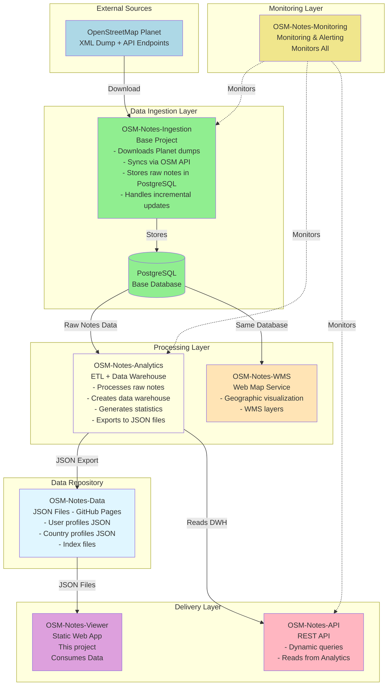
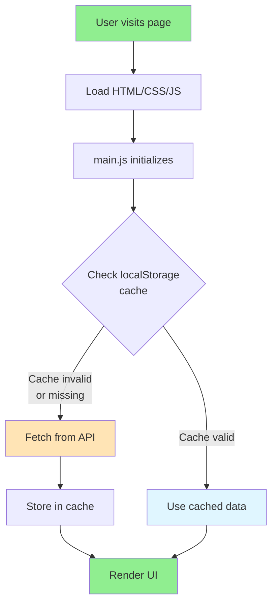
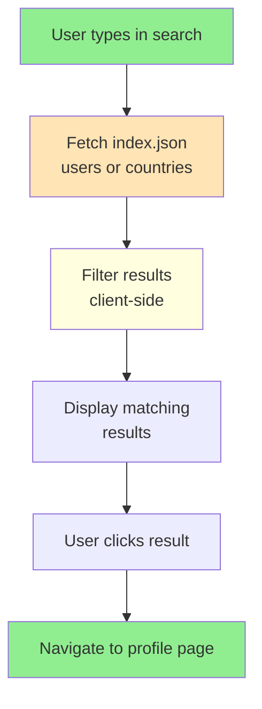
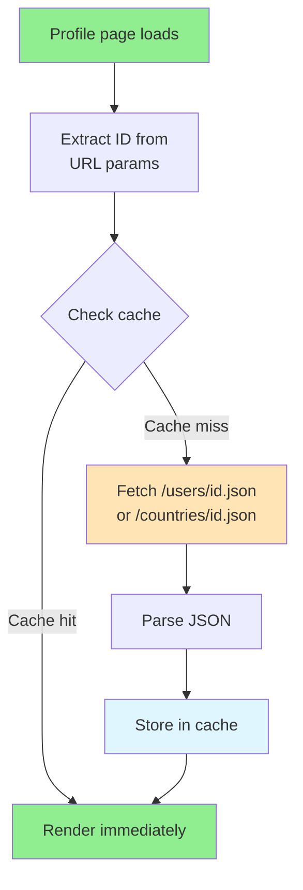
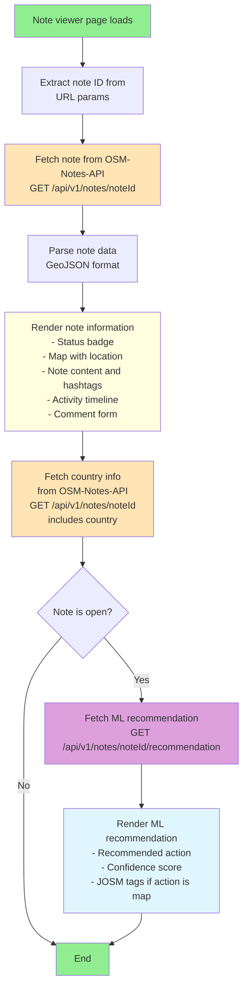
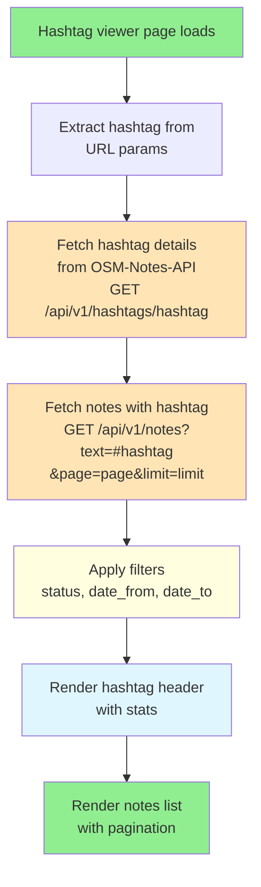
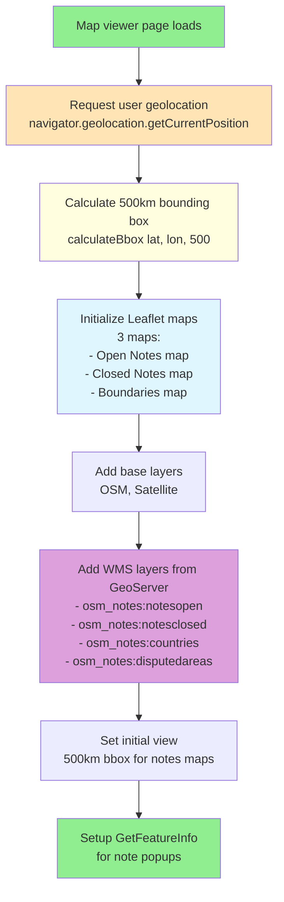

# Architecture Overview

## System Architecture

### Complete Ecosystem

This viewer is part of the **OSM-Notes ecosystem**, consisting of 8 interconnected projects:



**Note:** OSM-Notes-Common (shared libraries) is used as Git submodule by Ingestion, Analytics, WMS, and Monitoring (not by Viewer or API).

### OSM Notes Ecosystem (8 Projects)

1. **OSM-Notes-Ingestion** (base project) - Data ingestion from Planet/API
2. **OSM-Notes-Analytics** - ETL and data warehouse (generates Data)
3. **OSM-Notes-Data** - JSON files served via GitHub Pages (consumed by Viewer)
4. **OSM-Notes-Viewer** (this project) - Web application consuming Data
5. **OSM-Notes-API** - REST API (complementary to Viewer, reads from Analytics)
6. **OSM-Notes-WMS** - Web Map Service (geographic visualization)
7. **OSM-Notes-Monitoring** - Monitors all ecosystem components
8. **OSM-Notes-Common** - Shared libraries (Git submodule, used by Ingestion, Analytics, WMS, Monitoring)

**Note**: Viewer primarily consumes static JSON from OSM-Notes-Data (GitHub Pages), which is generated by OSM-Notes-Analytics. Viewer can also use OSM-Notes-API for dynamic queries and OSM-Notes-WMS for map layers.

See the main [README.md](../README.md) for complete ecosystem overview.

## Frontend Architecture

### Layer Structure

```mermaid
graph TB
    subgraph Presentation["Presentation Layer"]
        HTML[HTML Pages + CSS Styling]
    end
    
    subgraph Components["Component Layer"]
        COMP1[activityHeatmap.js]
        COMP2[workingHoursHeatmap.js]
        COMP_DESC[Reusable UI Components]
    end
    
    subgraph Business["Business Logic"]
        MAIN[main.js]
        USER[userProfile.js]
        COUNTRY[countryProfile.js]
        NOTE[noteViewer.js]
        HASHTAG[hashtagViewer.js]
        MAP[mapViewer.js]
        DESC[Page Controllers]
    end
    
    subgraph Data["Data Layer"]
        API_CLIENT[apiClient.js<br/>Static JSON API]
        REST_API[REST API calls<br/>OSM-Notes-API]
        WMS_INTEG[WMS layer integration<br/>GeoServer]
        CACHE[cache.js<br/>LocalStorage]
        FORMATTER[formatter.js<br/>Utilities]
    end
    
    Business -->|Uses| Components
    Components -->|Renders| Presentation
    Business -->|Uses| Data
    Data -->|Provides Data| Business
    
    subgraph Config["Configuration"]
        API_CONFIG[api-config.js<br/>Static JSON]
        REST_CONFIG[REST API endpoints<br/>OSM-Notes-API]
        WMS_CONFIG[WMS configuration<br/>GeoServer]
    end
    
    Business -->|Uses| Components
    Components -->|Renders| Presentation
    Business -->|Uses| Data
    Data -->|Provides Data| Business
    Config -->|Configures| Data
    
    style Presentation fill:#DDA0DD
    style Components fill:#FFE4B5
    style Business fill:#FFFFE0
    style Data fill:#E0F6FF
    style Config fill:#F0E68C
```



## Data Flow

### 1. Initial Page Load



### 2. Search Flow



### 3. Profile Page Flow


    RENDER_COMP[Render components<br/>- Statistics cards<br/>- Activity heatmap<br/>- Hashtags<br/>- Rankings<br/>- Working hours]
    
    style START fill:#90EE90
    style RENDER fill:#90EE90
    style FETCH fill:#FFE4B5
    style STORE fill:#E0F6FF
    style RENDER_COMP fill:#DDA0DD
```

### 4. Note Viewer Flow



### 5. Hashtag Viewer Flow



### 6. Map Viewer Flow



## Component Architecture

### API Client (apiClient.js)

**Responsibilities:**

- Fetch static JSON files
- Manage cache
- Handle errors
- Provide typed methods for each endpoint

**Key Methods:**

- `getMetadata()` - Export info
- `getUserIndex()` - All users list
- `getCountryIndex()` - All countries list
- `getUser(id)` - User profile
- `getCountry(id)` - Country profile

### REST API Integration

**Note Viewer (`noteViewer.js`):**

- Fetches individual note details from `OSM-Notes-API`
- Endpoint: `GET /api/v1/notes/{noteId}`
- Fetches ML recommendations: `GET /api/v1/notes/{noteId}/recommendation`
- Base URL: `https://notes-api.osm.lat` (production)

**Hashtag Viewer (`hashtagViewer.js`):**

- Fetches hashtag statistics: `GET /api/v1/hashtags/{hashtag}`
- Fetches notes with hashtag: `GET /api/v1/notes?text=#{hashtag}`
- Supports pagination and filtering (status, date_from, date_to)

**WMS Integration (`mapViewer.js`):**

- Consumes WMS layers from GeoServer
- Base URL: `https://geoserver.osm.lat/geoserver/osm_notes/wms`
- Layers: `osm_notes:notesopen`, `osm_notes:notesclosed`, `osm_notes:countries`,
  `osm_notes:disputedareas`
- Uses `leaflet.wms` plugin with native Leaflet fallback

### Cache System (cache.js)

**Responsibilities:**

- Store data in localStorage
- Validate cache age
- Clear expired cache
- Manage cache size

**Key Methods:**

- `cacheSet(key, data)` - Store data
- `cacheGet(key, maxAge)` - Retrieve if valid
- `cacheDelete(key)` - Remove entry
- `cacheClear()` - Clear all

### Formatter (formatter.js)

**Responsibilities:**

- Format numbers (1234 → 1,234)
- Format dates (ISO → readable)
- Format percentages
- Truncate text

## Caching Strategy

### Cache Levels

1. **Browser Cache** (HTTP headers)
   - Controlled by CDN/server
   - 15 minutes for data files
   - 1 hour for static assets

2. **LocalStorage Cache** (application level)
   - Managed by cache.js
   - 15 minutes TTL
   - Per-entity caching
   - Survives page refresh

3. **Memory Cache** (apiClient)
   - In-memory Map
   - Cleared on page unload
   - Fastest access

### Cache Keys

```
osm_notes_metadata          → metadata.json
osm_notes_index_users       → indexes/users.json
osm_notes_index_countries   → indexes/countries.json
osm_notes_user_123          → users/123.json
osm_notes_country_456       → countries/456.json
```

## Performance Considerations

### Initial Load Time

**Target:** < 2 seconds on 3G

**Optimizations:**

- Minimal CSS (< 10KB)
- Vanilla JS (no framework overhead)
- Lazy load components
- Cache index files aggressively

### Profile Page Load

**Target:** < 500ms with cache, < 2s without

**Optimizations:**

- Small JSON files (2-10 KB each)
- Client-side rendering
- Progressive loading
- Skeleton screens

### Search Performance

**Strategy:** Client-side filtering

**Why:**

- Index files are small (< 100 KB typically)
- No server required
- Instant results
- Works offline (if cached)

## Scalability

### Current Design Supports:

- **Users:** Up to 100,000 (index ~1 MB)
- **Countries:** Up to 500 (index ~50 KB)
- **JSON files:** Millions (fetched on-demand)

### If Scale Exceeds:

1. **Split index files** by letter/range
2. **Implement server-side search** API
3. **Add pagination** to index
4. **Consider database** backend

## Security Considerations

### Current (Static JSON)

- **No sensitive data** - All OSM data is public
- **No authentication** - Read-only viewer (historical data)
- **HTTPS required** - For CDN and site
- **No XSS risk** - All data properly escaped
- **No CSRF risk** - No state-changing operations

### Future (REST API)

- **Hybrid authentication strategy** - Historical data remains public, recent data requires
  User-Agent
- **User-Agent required** - Valid User-Agent header required for all API endpoints (format:
  `AppName/Version (Contact)`)
- **OAuth 2.0 with OSM** - Optional, only for specific endpoints that require user identity
- **Rate limiting** - Per IP + User-Agent limits for API access
- **Usage analytics** - Track and analyze API usage patterns by application (User-Agent)

This approach is aligned with the [OSM-Notes-API proposal](../OSM-Notes-API/docs/API_Proposal.md).
For detailed information about the authentication strategy, see
[AUTHENTICATION_STRATEGY.md](Authentication_Strategy.md).

## Browser Compatibility

### Required Features:

- ES6 Modules
- Fetch API
- LocalStorage
- Promises/async-await
- CSS Grid

### Minimum Versions:

- Chrome: 61+
- Firefox: 60+
- Safari: 11+
- Edge: 79+

### Progressive Enhancement:

- Core functionality works without JS (minimal)
- Enhanced with JS modules
- Graceful degradation for older browsers

## Data Sources

### Static JSON Files (Historical Data)

- **Base URL:** `https://notes.osm.lat/data`
- **Format:** Pre-generated JSON files
- **Update Frequency:** Every 15 minutes
- **Caching:** 15 minutes TTL
- **Endpoints:**
  - `/metadata.json`
  - `/indexes/users.json`
  - `/indexes/countries.json`
  - `/users/{hex_path}/{user_id}.json`
  - `/countries/{country_id}.json`

### REST API (Recent Data & Features)

- **Base URL:** `https://notes-api.osm.lat`
- **Format:** REST API with JSON responses
- **Update Frequency:** Real-time (updated every 15 minutes)
- **Authentication:** User-Agent header required
- **Endpoints:**
  - `GET /api/v1/notes/{noteId}` - Individual note details
  - `GET /api/v1/notes?text={query}` - Search notes
  - `GET /api/v1/hashtags/{hashtag}` - Hashtag statistics
  - `GET /api/v1/notes/{noteId}/recommendation` - ML recommendations

### WMS Service (Map Layers)

- **Base URL:** `https://geoserver.osm.lat/geoserver/osm_notes/wms`
- **Format:** OGC WMS 1.1.0
- **Layers:**
  - `osm_notes:notesopen` - Open notes
  - `osm_notes:notesclosed` - Closed notes
  - `osm_notes:countries` - Country boundaries
  - `osm_notes:disputedareas` - Disputed areas
- **Features:** GetFeatureInfo for note popups

## ML Integration

### ML Recommendations API

- **Endpoint:** `GET /api/v1/notes/{noteId}/recommendation`
- **Response Format:**
  ```json
  {
    "action": "close|comment|map",
    "confidence": 0.0-1.0,
    "reason": "Explanation text",
    "tags": {
      "amenity": "restaurant",
      "name": "Example"
    }
  }
  ```
- **Usage:** Only shown for open notes
- **JOSM Tags:** If action is "map", tags are formatted for JOSM editor

## Future Architecture

### Potential Enhancements:

1. **Service Worker** for offline mode (PWA support)
2. **IndexedDB** for larger cache
3. **WebSocket** for real-time updates
4. **GraphQL** layer for flexible queries
5. **Server-Side Rendering** for better SEO
6. **Web Components** for better encapsulation
7. **OAuth Integration** for note actions (comment, close, reopen)

### Migration Path:

Current (Vanilla JS) → React/Vue → Next.js/Nuxt → Full-stack

Each step adds complexity but also features. Start simple, evolve as needed.
