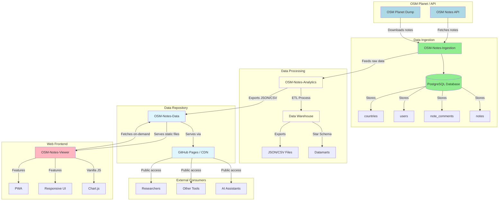

# Architecture Diagrams

## Component Flow Diagram

This diagram shows the data flow from OpenStreetMap ingestion through analytics to the web viewer.

### Mermaid Diagram



### PlantUML Source

For more advanced diagrams, see `architecture-diagrams.puml` which can be rendered with [PlantUML](https://plantuml.com).

To render the PlantUML file:

```bash
# Install PlantUML
sudo apt-get install plantuml  # Ubuntu/Debian
brew install plantuml          # macOS

# Generate image
plantuml docs/architecture-diagrams.puml

# Output: docs/architecture-diagrams.png
```

### Online Rendering

You can also render these diagrams online:

- **Mermaid**: Use [Mermaid Live Editor](https://mermaid.live/) or [GitHub](https://github.com) (native support)
- **PlantUML**: Use [PlantUML Online Server](http://www.plantuml.com/plantuml/uml/) or [PlantText](https://www.planttext.com/)

## Data Flow Summary

1. **OSM Planet/API** provides raw notes data
2. **OSM-Notes-Ingestion** downloads and stores data in PostgreSQL
3. **OSM-Notes-Analytics** processes data into a star schema data warehouse
4. **OSM-Notes-Data** serves static exports via GitHub Pages
5. **OSM-Notes-Viewer** fetches and visualizes data in the browser
6. **External consumers** (AI, tools, researchers) access public exports

This architecture provides:
- ✅ Separation of concerns
- ✅ Scalable data processing
- ✅ Static, CDN-friendly web deployment
- ✅ Public, accessible data exports

